# Hyperswitch Bundle Analyzer — Architecture & Deep Dive

> **AI-powered webpack bundle analysis, purpose-built for the Hyperswitch Web SDK**

---

## Table of Contents

1. [Project Overview](#1-project-overview)
2. [Why Not Just Ask an AI Agent?](#2-why-not-just-ask-an-ai-agent)
3. [Architecture Overview](#3-architecture-overview)
4. [Pipeline Flow](#4-pipeline-flow)
5. [Module-by-Module Breakdown](#5-module-by-module-breakdown)
6. [Data Flow Diagrams](#6-data-flow-diagrams)
7. [Detection Rules Engine](#7-detection-rules-engine)
8. [AI Integration — Deep Context, Not Shallow Prompting](#8-ai-integration--deep-context-not-shallow-prompting)
9. [Report Generation & GitHub Integration](#9-report-generation--github-integration)
10. [Key Design Decisions](#10-key-design-decisions)

---

## 1. Project Overview

**Hyperswitch Bundle Analyzer** is a zero-dependency, AI-powered webpack bundle analysis tool specifically built for the [Hyperswitch Web SDK](https://github.com/juspay/hyperswitch-web) — a ReScript/React payment orchestration UI.

### What It Does

Given two git refs (e.g., `main` and a PR branch), the tool:

1. **Clones and builds** both versions of the repo with production webpack configs
2. **Parses** the raw webpack `--json --profile` stats into structured data
3. **Computes a three-level diff** — modules, assets (output files), and entrypoints
4. **Runs 11 deterministic detection rules** to flag regressions, duplicates, tree-shaking failures, etc.
5. **Sends deeply-structured context to an AI model** for expert-level root cause analysis
6. **Generates rich reports** — text, JSON, Markdown, and GitHub PR comments

### Key Facts

| Property | Value |
|----------|-------|
| Total Source Code | ~8,000 lines across 17 files |
| Dependencies | **Zero** (Node.js built-ins + native `fetch()` only) |
| Test Suite | 100+ tests with custom framework (2,400 lines) |
| AI Model | `kimi-latest` via OpenAI-compatible API |
| Target Project | juspay/hyperswitch-web (ReScript/React/Webpack) |
| Node.js Requirement | >= 18.0.0 |

---

## 2. Why Not Just Ask an AI Agent?

This is the critical question: *"Why build a dedicated tool when I can just paste webpack stats into ChatGPT and ask what changed?"*

The short answer: **a generic AI prompt gives you guesses; this tool gives you evidence-based, attributable, actionable analysis.**

### The Comparison

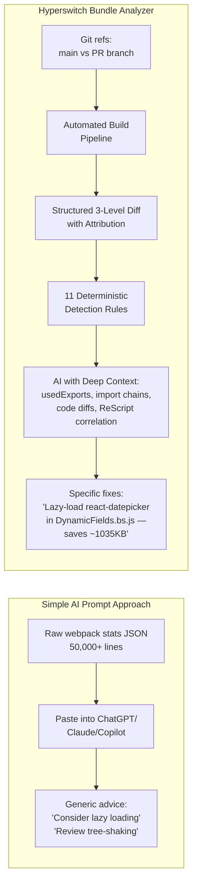

### Detailed Breakdown: What Goes Wrong with a Simple Prompt

| Dimension | Simple AI Prompt | This Tool |
|-----------|-----------------|-----------|
| **Input Quality** | Raw stats JSON (often truncated due to token limits — a single webpack stats file can be 50,000+ lines) | Structured, deduplicated, normalized data with noise filtered out |
| **Context Window** | Stats alone consume most of the context — no room for code diffs, import chains, or project knowledge | Curated context: only the top 10 changes, relevant import chains, usedExports ratios, code diffs, and ReScript correlations |
| **Deterministic Checks** | None — the AI might miss a duplicate package or budget violation | 11 hard-coded rules run BEFORE the AI, catching issues with 100% reliability |
| **Attribution** | AI says "lodash grew" — but WHY? Which file imported it? | Every asset and entrypoint change is attributed to specific modules with exact byte deltas |
| **Additive Accounting** | Raw webpack stats double-count concatenated modules — the AI has no way to know this | `ModuleConcatenationPlugin` deduplication ensures `assetDelta = sum(moduleDelta)` |
| **Domain Knowledge** | Generic understanding of webpack | Hard-coded knowledge: ReScript compilation patterns, Hyperswitch SDK entrypoints, payment SDK dynamic loading, specific dependency allowlists |
| **Reproducibility** | Different answers every time | Deterministic pipeline + structured AI prompt = consistent, auditable results |
| **CI/CD Integration** | Manual copy-paste | One command in CI, auto-posts PR comment with verdict |
| **False Positive Filtering** | AI doesn't know that <=10 byte changes are webpack hash churn | 10-byte noise threshold eliminates hundreds of false changes |
| **Actionability** | "Consider optimizing your bundles" | "Dynamically import react-datepicker in DynamicFields.bs.js — saves ~1035KB from initial load" |

### The Information Gap

When you paste raw webpack stats into an AI agent, here is what it **cannot** know:

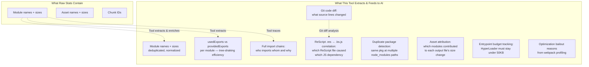

### A Concrete Example

**Scenario**: A PR adds a date picker to a checkout form.

**Simple AI Prompt Result** (after pasting truncated stats):
> "The bundle size increased by approximately 200KB. This appears to be due to new dependencies. Consider lazy loading large dependencies and review whether all imports are necessary."

**This Tool's Result**:
> **Verdict: needs_review** (confidence: 0.82)
>
> **Root Cause**: `react-datepicker` (1,035 KB raw, ~310 KB gzip) pulled in via `DynamicFields.bs.js` and `DateOfBirth.bs.js`. This single dependency accounts for 94% of the bundle increase.
>
> **Detections**:
> - `[CRITICAL]` unexpected-dependency: `react-datepicker` is not in the allowed dependency list
> - `[WARNING]` large-new-dependency: `react-datepicker` adds 1,035 KB (310 KB gzip)
> - `[WARNING]` entrypoint-budget: HyperLoader now at 62 KB (budget: 50 KB)
>
> **Suggested Fixes**:
> 1. Dynamically import `react-datepicker` in `DynamicFields.bs.js` using `React.lazy()` — defers 1,035 KB from initial load
> 2. Replace `react-datepicker` with `input type="date"` (native browser date picker, 0 KB) if cross-browser consistency is not critical
> 3. If `react-datepicker` is kept, add it to the allowed dependency list in `rule-engine.js`

---

## 3. Architecture Overview

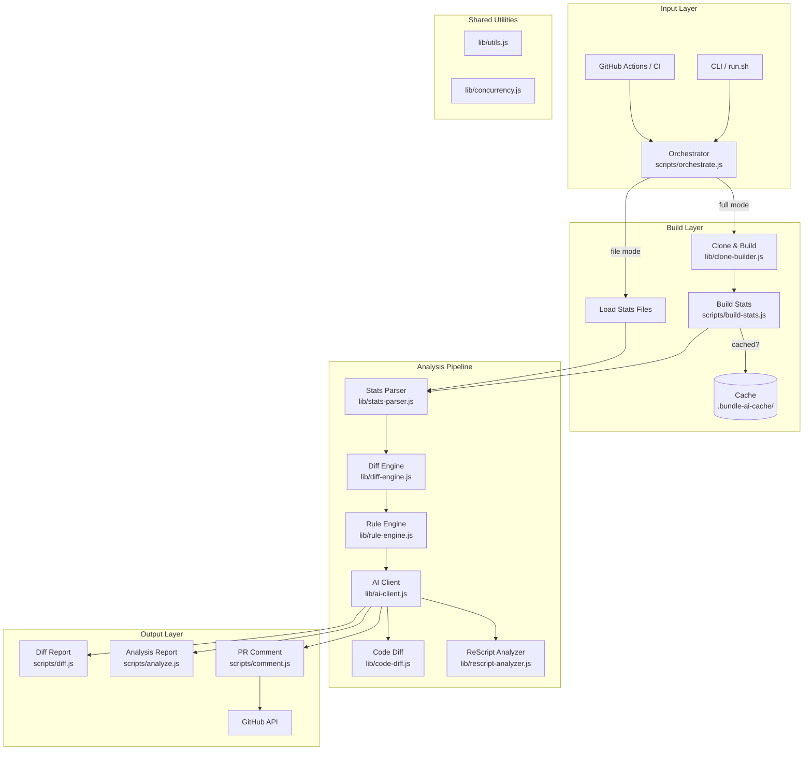

### Two Operating Modes

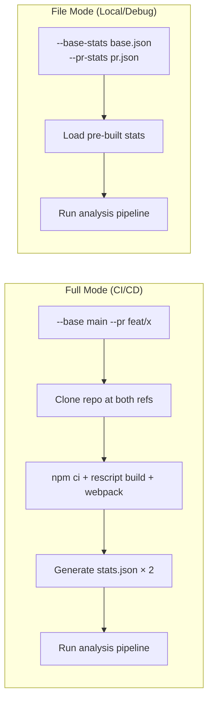

---

## 4. Pipeline Flow

The entire analysis runs as a **6-phase linear pipeline** with parallelized sub-steps:

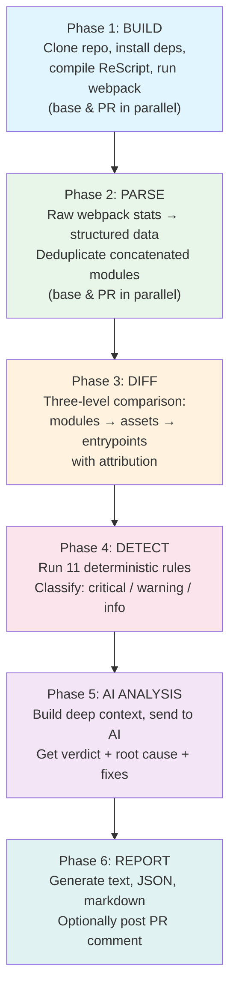

### Detailed Phase Sequence

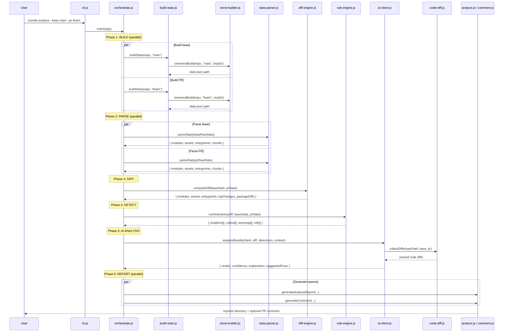

---

## 5. Module-by-Module Breakdown

### 5.1 Entry Points

#### `cli.js`
The npm `bin` entry point. A thin shim:
```
#!/usr/bin/env node → require('./scripts/orchestrate.js').main()
```

#### `run.sh`
Shell alternative: `node scripts/orchestrate.js "$@"`

---

### 5.2 Core Library (`lib/`)

#### `lib/stats-parser.js` — Webpack Stats Parser (545 lines)

**Purpose**: Transforms raw webpack `--json --profile` output (~50,000 lines) into clean, structured data.

**Key responsibilities**:
- **Module extraction**: Pulls module name, size, reasons (who imported it), usedExports, and chunk membership
- **Concatenation deduplication**: Webpack's `ModuleConcatenationPlugin` merges modules — this parser extracts inner modules and avoids double-counting their sizes
- **Package grouping**: Groups `node_modules` modules by package name (handles scoped packages like `@juspay/foo`)
- **Asset parsing**: Extracts output file names, sizes, and chunk associations
- **Entrypoint parsing**: Maps entrypoints (e.g., `HyperLoader`, `app`) to their constituent assets and total sizes
- **Duplicate detection**: Finds the same package installed at multiple `node_modules` paths (a common cause of bundle bloat)
- **Compression estimation**: Estimates gzip/brotli sizes using fixed ratios (JS: 30%/25%, CSS: 25%/20%)

```mermaid
graph LR
    A[Raw webpack stats<br/>~50K lines JSON] --> B[stats-parser.js]
    B --> C[modules[]: name, size,<br/>reasons, usedExports, chunks]
    B --> D[assets[]: name, size,<br/>chunkNames, compressed]
    B --> E[entrypoints[]: name,<br/>assets, totalSize]
    B --> F[byPackage: { name → size }]
    B --> G[duplicates[]: name,<br/>paths, wastedSize]
```

---

#### `lib/diff-engine.js` — Bundle Diff Engine (1,000 lines)

**Purpose**: Computes a comprehensive, three-level diff between base and PR stats, with full attribution.

**Three levels of diffing**:

1. **Module-level diff**: Which modules were added, removed, changed, or unchanged
2. **Asset-level diff**: How each output file's size changed, and WHY (attributed to specific modules)
3. **Entrypoint-level diff**: How each entrypoint changed, with per-asset and per-module attribution

**Key behaviors**:
- **Normalized grouping keys**: Strips loader prefixes, query strings, and concatenated module suffixes to match modules across branches
- **Additive size correction**: Replaces raw asset sizes with the sum of constituent module sizes, ensuring `assetDelta = sum(moduleDelta)` — this makes changes fully explainable
- **Noise filtering**: Changes <= 10 bytes are classified as `unchanged` to filter webpack hash churn
- **Reason attribution**: For each asset/entrypoint change, identifies the top contributing modules with per-module deltas and percentage contributions

```mermaid
graph TD
    BASE[Base Stats] --> DE[diff-engine.js]
    PR[PR Stats] --> DE
    
    DE --> MD[Module Diff<br/>added / removed / changed / unchanged<br/>with sizeDelta per module]
    DE --> AD[Asset Diff<br/>per output file<br/>with top contributing modules]
    DE --> ED[Entrypoint Diff<br/>per entrypoint<br/>with per-asset breakdown]
    DE --> TC[Top Changes<br/>sorted by |delta|<br/>with import chains]
    DE --> PD[Package Diffs<br/>aggregate delta per npm package]
    
    AD --> |"attributed to"| MD
    ED --> |"attributed to"| AD
```

---

#### `lib/rule-engine.js` — Detection Rules Engine (599 lines)

**Purpose**: Runs 11 deterministic detection rules. These catch issues with 100% reliability — no AI guessing.

**See [Section 7](#7-detection-rules-engine) for the full rule catalog.**

---

#### `lib/ai-client.js` — AI Integration (843 lines)

**Purpose**: Builds rich context, constructs domain-specific prompts, calls the AI API, and parses structured responses.

**See [Section 8](#8-ai-integration--deep-context-not-shallow-prompting) for the deep dive.**

---

#### `lib/code-diff.js` — Code Diff Analyzer (140 lines)

**Purpose**: Parses unified git diffs and chunks them for AI analysis.

**Exports**:
- `parseDiff(diffText)` → array of `{ file, hunks[] }` — parses unified diff format
- `chunkDiffs(parsedDiffs, maxChunkSize)` → text chunks bounded by token budget
- `collectDiffs(repoPath, baseRef, prRef, relevantPaths)` → runs `git diff` and returns parsed results

---

#### `lib/rescript-analyzer.js` — ReScript Source Analyzer (339 lines)

**Purpose**: Analyzes ReScript (`.res`) source files to extract dependency information that webpack stats cannot reveal.

**What it extracts from `.res` files**:
- `open ModuleName` statements (module dependencies)
- `module X = { ... }` definitions
- `@module("pkg") external ...` FFI bindings (JavaScript interop)
- `%raw("require('pkg')")` / `%raw("import('pkg')")` patterns (raw JS imports)

**Why this matters**: ReScript compiles to JavaScript, so webpack stats show `.bs.js`/`.res.js` files — not the original `.res` source. This analyzer bridges the gap, allowing the AI to say *"the ReScript file `PaymentForm.res` added an `@module("react-datepicker")` binding, which pulled 1,035 KB into the bundle"* instead of just *"some compiled JS file imported react-datepicker"*.

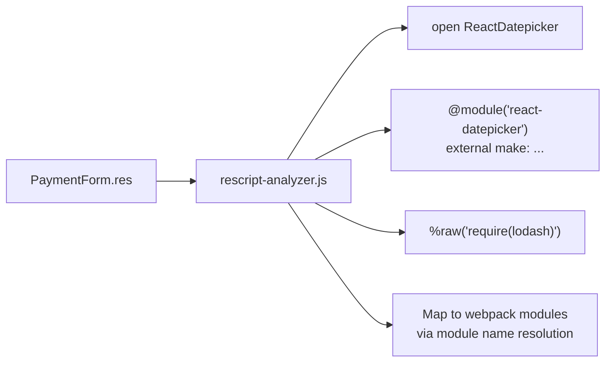

---

#### `lib/concurrency.js` — Bounded Parallelism (39 lines)

**Purpose**: Runs async tasks with bounded concurrency. Used to parallelize builds, AI chunk analysis, and report generation.

```javascript
// Run up to 4 tasks simultaneously
await pooled(tasks, 4);
```

---

#### `lib/utils.js` — Shared Utilities (96 lines)

**Exports**:
- `formatBytes(bytes)` → `"1.5 KB"`, `"-320 B"`, `"+2.3 MB"`
- `loadEnv()` → Parses `.env` file into `process.env` (no `dotenv` dependency)
- `getRootCause(module, reasons)` → Traces webpack `reasons` to find the original import source
- `validateGitRef(ref)` → Validates git refs (no spaces, shell metacharacters)

---

### 5.3 Scripts (`scripts/`)

#### `scripts/orchestrate.js` — Main Orchestrator (705 lines)

The brain of the operation. Parses CLI arguments, selects operating mode (full vs. file), and runs all 6 pipeline phases in sequence with parallelized sub-steps.

**CLI arguments**:

| Flag | Description | Default |
|------|-------------|---------|
| `--base <ref>` | Base branch/tag/SHA | `main` |
| `--pr <ref>` | PR branch/tag/SHA | (required in full mode) |
| `--repo-url <url>` | Repository URL | from `.env` |
| `--base-stats <path>` | Pre-built base stats (file mode) | — |
| `--pr-stats <path>` | Pre-built PR stats (file mode) | — |
| `--output <dir>` | Report output directory | `reports/` |
| `--format <type>` | `text`, `json`, `markdown`, `all` | `all` |
| `--no-ai` | Skip AI analysis | `false` |
| `--post-comment` | Post GitHub PR comment | `false` |
| `--pr-number <n>` | PR number for commenting | — |
| `--model <name>` | AI model to use | `kimi-latest` |
| `--force-build` | Skip cache | `false` |

---

#### `scripts/build-stats.js` — Build Manager (351 lines)

Manages the build process with caching:

```mermaid
graph TD
    REF[Git ref: main] --> HASH[Hash: sha256(repoUrl + ref)]
    HASH --> CHECK{Cache hit?}
    CHECK -->|yes| LOAD[Load cached stats.json]
    CHECK -->|no| BUILD[Clone → npm ci →<br/>rescript build → webpack --json]
    BUILD --> SAVE[Save to .bundle-ai-cache/]
    LOAD --> RETURN[Return stats path]
    SAVE --> RETURN
```

---

#### `scripts/diff.js` — Diff Report Generator (443 lines)

Generates human-readable diff reports:
- **Summary table**: Total size change, module count, asset count
- **Asset changes**: Per-output-file size changes with top contributors
- **Entrypoint changes**: Per-entrypoint size changes with per-asset breakdown
- **Top module changes**: Largest individual module changes
- **Reason attribution**: For each change, which modules caused it

---

#### `scripts/analyze.js` — Analysis Report Generator (586 lines)

Generates full analysis reports combining diff, detections, and AI results:
- Executive summary with verdict and confidence
- Detection results by severity (critical → warning → info)
- AI recommendations with estimated savings
- Detailed module-level analysis
- Full diff tables

---

#### `scripts/comment.js` — GitHub PR Comment Generator (608 lines)

Generates GitHub-flavored Markdown for PR comments:

```mermaid
graph TD
    A[Analysis Results] --> B[comment.js]
    B --> C["## 📦 Bundle Analysis Report"]
    C --> D[Summary Table:<br/>Base Size | PR Size | Change]
    D --> E["### 📁 Output Files<br/>(collapsible asset table)"]
    E --> F["### 🔍 Detected Issues<br/>(grouped by severity)"]
    F --> G["### 🤖 AI Analysis<br/>(verdict + recommendations)"]
    G --> H["### 📊 Top Contributors<br/>(module-level changes)"]
    H --> I[Footer with metadata]
    
    B --> POST[POST to GitHub API<br/>via native fetch()]
```

---

### 5.4 Tests (`test/`)

#### `test/test-runner.js` (2,398 lines)

A comprehensive test suite using a **custom test framework** (no Jest/Mocha — consistent with zero-dependency philosophy).

**Coverage**: Every module has dedicated test cases:

| Module | Tests | What's Tested |
|--------|-------|--------------|
| stats-parser | ~20 | Parsing, deduplication, compression, duplicates, scoped packages |
| diff-engine | ~20 | Added/removed/changed, noise threshold, attribution, entrypoints |
| rule-engine | ~15 | All 11 rules individually with synthetic data |
| rescript-analyzer | ~10 | open, module, external, %raw extraction |
| ai-client | ~10 | Context building, prompt construction, response parsing |
| utils | ~10 | formatBytes, validateGitRef, getRootCause |
| code-diff | ~5 | Diff parsing, chunking |
| concurrency | ~5 | Parallelism bounds, error propagation |
| Integration | ~10 | Full pipeline with sample stats fixtures |

**Fixtures**: `test/sample-base-stats.json` and `test/sample-pr-stats.json` provide minimal but realistic webpack stats for integration testing.

---

## 6. Data Flow Diagrams

### 6.1 Complete Data Transformation Pipeline

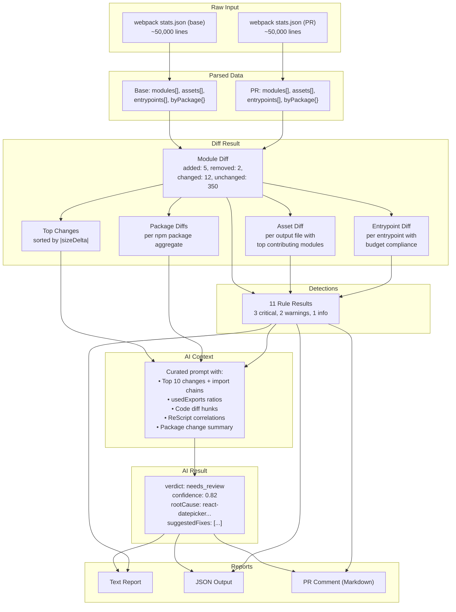

### 6.2 Module Dependency Graph

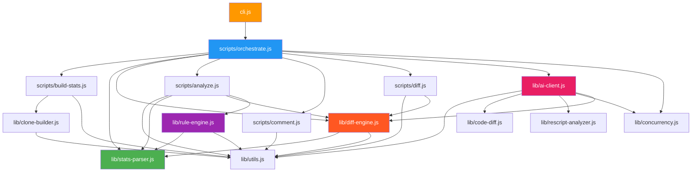

### 6.3 How Asset Attribution Works

This is one of the tool's most valuable features — explaining **why** an output file changed:

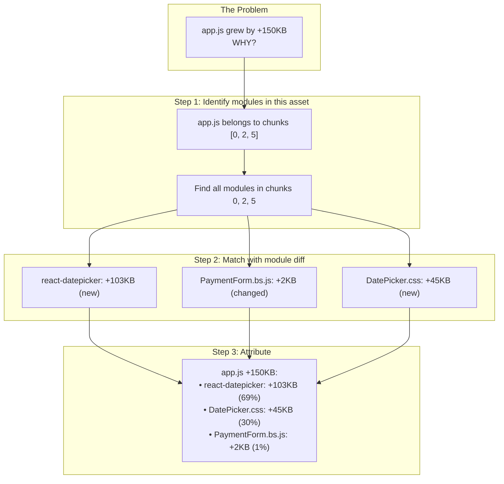

---

## 7. Detection Rules Engine

The rule engine runs **before** the AI, providing deterministic, guaranteed detection of common bundle issues.

```mermaid
graph TD
    DIFF[Diff Result] --> RE[Rule Engine]
    BASE[Base Stats] --> RE
    PR[PR Stats] --> RE
    
    RE --> R1["Rule 1: unexpected-dependency<br/>CRITICAL: New package not in allowlist"]
    RE --> R2["Rule 2: large-new-dependency<br/>WARNING: New package > 30KB"]
    RE --> R3["Rule 3: duplicate-package<br/>WARNING: Same pkg at multiple paths"]
    RE --> R4["Rule 4: significant-size-increase<br/>WARNING: Module > 20% growth & > 1KB"]
    RE --> R5["Rule 5: large-asset-increase<br/>WARNING: Asset > 5% growth & > 5KB"]
    RE --> R6["Rule 6: tree-shaking-failure<br/>WARNING: < 50% exports used & > 5KB"]
    RE --> R7["Rule 7: entrypoint-budget<br/>CRITICAL: Entrypoint exceeds budget"]
    RE --> R8["Rule 8: new-entrypoint<br/>INFO: New entrypoint appeared"]
    RE --> R9["Rule 9: removed-entrypoint<br/>WARNING: Entrypoint disappeared"]
    RE --> R10["Rule 10: chunk-count-change<br/>INFO: Chunk count changed > 10%"]
    RE --> R11["Rule 11: module-count-change<br/>INFO: Module count changed > 10%"]
    
    R1 --> OUT[Detection Results:<br/>violations[], critical[],<br/>warnings[], info[]]
    R2 --> OUT
    R3 --> OUT
    R4 --> OUT
    R5 --> OUT
    R6 --> OUT
    R7 --> OUT
    R8 --> OUT
    R9 --> OUT
    R10 --> OUT
    R11 --> OUT
```

### Entrypoint Budget Table

The tool enforces specific size budgets for Hyperswitch SDK entrypoints:

| Entrypoint | Budget | Rationale |
|------------|--------|-----------|
| `HyperLoader` | 50 KB | Critical-path loader — must be tiny |
| `app` | 500 KB | Main payment UI |
| Others | 300 KB | Default budget |

---

## 8. AI Integration — Deep Context, Not Shallow Prompting

This is where the tool fundamentally differs from pasting stats into an AI chat.

### What the AI Receives

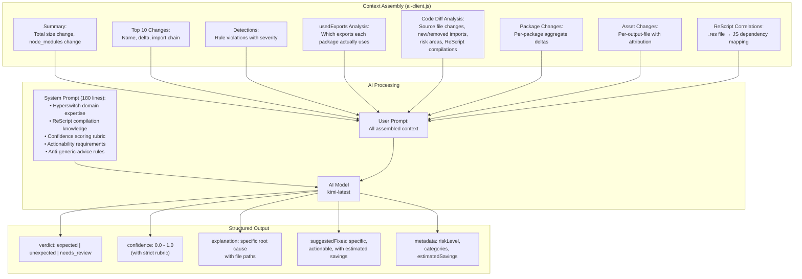

### The System Prompt's Anti-Generic Rules

The system prompt explicitly forbids generic advice:

| What the AI MUST NOT Say | What the AI MUST Say Instead |
|--------------------------|------------------------------|
| "Consider lazy loading large dependencies" | "Dynamically import react-datepicker in DynamicFields.bs.js and DateOfBirth.bs.js using React.lazy() — this single change would defer 1035KB from initial load" |
| "Review tree-shaking configuration" | "recoil ships 269KB but only 5 exports are used (RecoilRoot, atom, useRecoilState, useRecoilValue, useSetRecoilState). Since recoil doesn't support tree-shaking well, consider jotai (2KB) as a drop-in replacement" |
| "Check if all imports are necessary" | "@sentry/react pulls in @sentry-internal/replay (293KB) for session replay. If session replay is not used, configure Sentry with { replaysSessionSampleRate: 0 } or import from @sentry/react/minimal to exclude replay" |

### Confidence Scoring Rubric

| Range | Meaning | Example |
|-------|---------|---------|
| 0.90–0.99 | Very high certainty | Zero diff, or obvious full-library import |
| 0.75–0.89 | High certainty | Known dependency proportional to code change |
| 0.50–0.74 | Moderate certainty | Mixed signals or partial evidence |
| 0.25–0.49 | Low certainty | Ambiguous, multiple explanations possible |
| 0.01–0.24 | Very low certainty | Insufficient data |

### Fallback Behavior

If the AI API is unavailable (timeout, no API key, rate limit), the tool **gracefully degrades** to rule-based analysis only — all 11 detection rules still run, the diff is still computed, and reports are still generated. The AI verdict section simply shows "AI analysis unavailable."

---

## 9. Report Generation & GitHub Integration

### Report Types

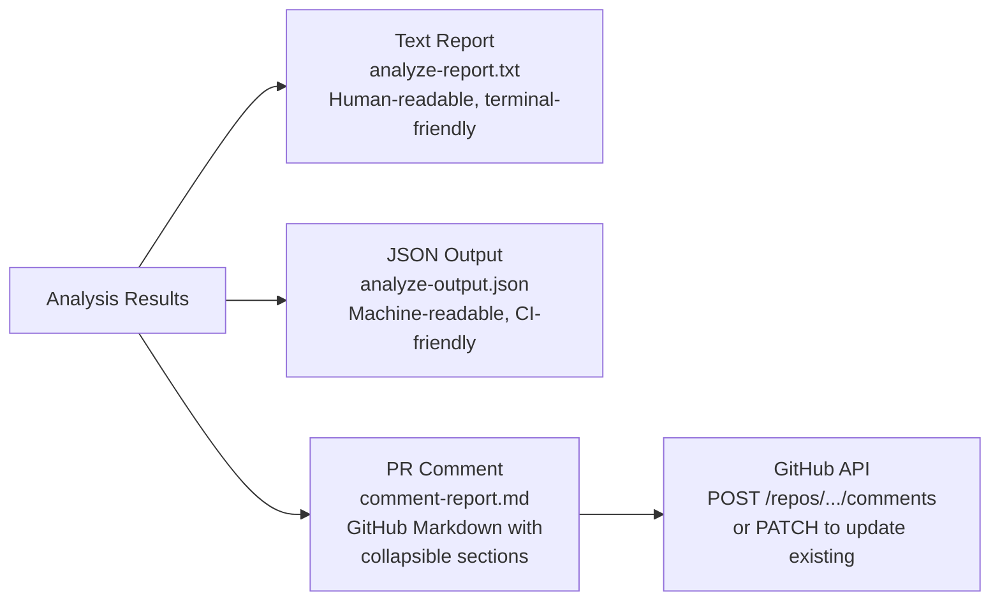

### PR Comment Structure

The GitHub PR comment follows this structure:

```
## 📦 Bundle Analysis Report

| Metric | Value |
|--------|-------|
| Base Size | 2.1 MB |
| PR Size | 2.3 MB |
| Change | +200 KB ⚠️ |
| node_modules | +195 KB |

### 📁 Output Files
(table of changed output files with top contributors)

<details><summary>### 🔍 Detected Issues (3 critical, 2 warnings)</summary>
- [CRITICAL] unexpected-dependency: react-datepicker...
- [CRITICAL] entrypoint-budget: HyperLoader exceeds 50KB...
- [WARNING] large-new-dependency: react-datepicker adds 1,035KB...
</details>

<details><summary>### 🤖 AI Analysis</summary>
Verdict: needs_review (confidence: 0.82)
Root Cause: ...
Recommended Fixes: ...
</details>

### 📊 Top Contributors
(module-level change table)
```

### Comment Upsert Logic

The tool uses **upsert semantics** — if a previous analysis comment exists on the PR, it updates it instead of creating a duplicate:

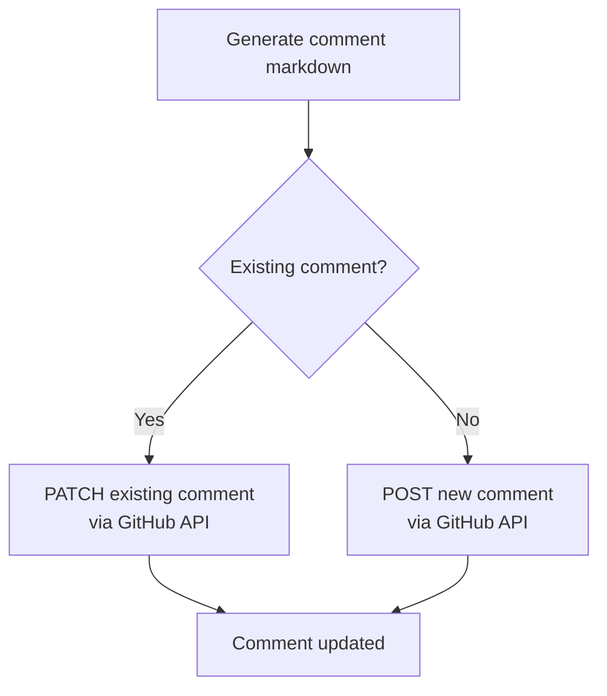

---

## 10. Key Design Decisions

### 10.1 Zero Dependencies

The entire tool uses **only Node.js built-ins** (`fs`, `path`, `child_process`, `crypto`, `url`) and native `fetch()`.

**Why**: In CI environments, dependency installation can fail, introduce supply chain risks, or add latency. Zero dependencies means the tool runs instantly with just `node cli.js`.

### 10.2 Additive Size Accounting

Raw webpack asset sizes include minification artifacts. The tool replaces them with the sum of constituent module sizes, ensuring:

```
assetDelta = sum(moduleDelta for each module in this asset)
```

**Why**: This makes every size change fully explainable and attributable. The PR comment can show exactly which modules caused each output file to grow or shrink.

### 10.3 Deterministic Rules Before AI

The 11 detection rules run **before** the AI and their results are **included in the AI's context**. This means:

- Critical issues (like an unexpected dependency) are caught with 100% reliability, regardless of AI quality
- The AI can reference detection results in its analysis, improving its reasoning
- Even without AI (e.g., API key missing), the tool provides actionable results

### 10.4 Domain-Specific AI Prompting

The AI system prompt is 180 lines of hard-coded domain knowledge. It knows about:

- ReScript compilation patterns (`.res` → `.bs.js`)
- Payment SDK dynamic loading (Stripe, PayPal, etc. are NOT in the bundle)
- Specific Hyperswitch dependencies and their expected sizes
- Webpack `ModuleConcatenationPlugin` behavior
- How to give actionable advice with specific file names and estimated savings

This is **not transferable generic knowledge** — it is purpose-built context that no generic AI prompt could replicate without extensive manual curation per query.

### 10.5 Noise Filtering

Changes <= 10 bytes are classified as `unchanged`. Webpack rebuilds can introduce tiny changes from hash churn, source map offsets, or comment differences. Without this filter, a typical diff might show 300+ "changed" modules when only 5 actually changed meaningfully.

### 10.6 Custom Test Framework

The test suite uses a 100-line custom `describe`/`it`/`assert` framework instead of Jest or Mocha — maintaining the zero-dependency philosophy while providing 100+ tests across all modules.

---

## Summary

The Hyperswitch Bundle Analyzer is not "ChatGPT for webpack stats." It is a **structured analysis pipeline** that:

1. **Extracts** what raw stats cannot tell you (import chains, usedExports, code diffs, ReScript correlations)
2. **Guarantees** detection of known issues through 11 deterministic rules
3. **Attributes** every size change to specific modules, packages, and source files
4. **Focuses** the AI on a curated, domain-specific context — producing actionable fixes with file names and estimated savings, not generic advice
5. **Integrates** into CI/CD with one command, posting rich PR comments automatically

The result: every PR to the Hyperswitch Web SDK gets an evidence-based, attributable, actionable bundle analysis — automatically, reliably, and with zero manual effort.
